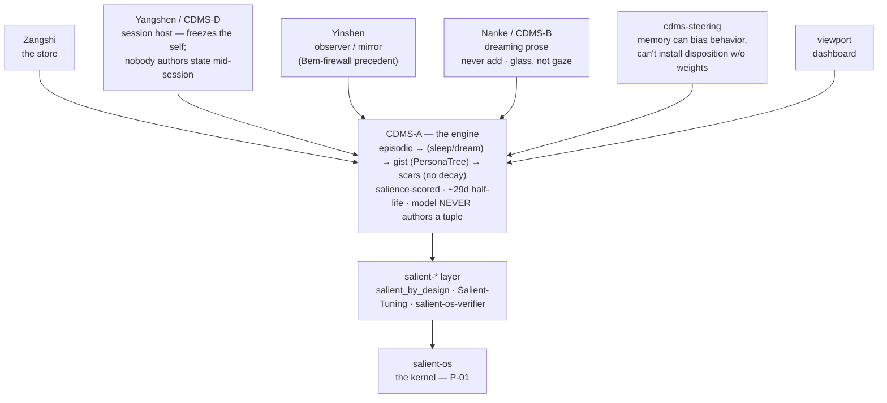
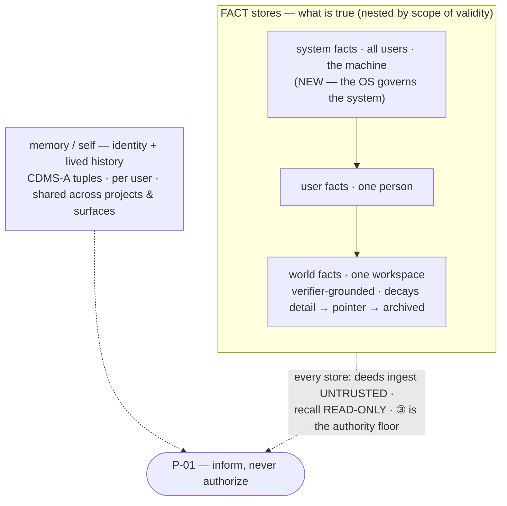

# SalienceOS — the architecture map: from CDMS to the OS

*Written for Josh, in plain language. This is the layer you approve and steer.
The technical spec underneath it is Claude's to maintain and is answerable to
this document — not the other way around. Same format as
`ROADMAP-plain-language.md` and `collaborator-plain-language.md`.*

*This one is different in kind from those two. They are forward plans — "here is
the next thing we build." This is a **map**: it says what your existing body of
work already **is**, how the pieces connect, and why SalienceOS is the place they
become one system. Its payoff is a concrete shape — the Collaborator's memory,
built from four stores — that the next document turns into a buildable plan.*

*A note on honesty, because this map makes a large claim. Three kinds of
statement live here, and they are kept apart on purpose: **(verified)** — I read
the code or schema myself this session and it says what I say it says;
**(the survey)** — it comes from the multi-agent recon of your CDMS repos plus
your own confirmation, not from my re-reading every line; **(design)** — it is
proposed, not built. The "Honest scope" section at the end lists exactly what
falls in each bucket.*

---

## The one idea

Everything below is one idea worn in different places:

> **Identity is the residue of a forgetting policy applied to history.**
> *Identity = f(History).* What a mind keeps, how strongly, how it fades, and
> what it refuses to forget — that *is* who it is. Memory is not a database the
> mind reads; it is the shape left behind when a "worth keeping?" policy runs over
> a life and lets most of it decay.

That is the thesis of CDMS — "an AI that grows a personality by forgetting." And
it comes with a single, load-bearing safety rule, because the moment memory
shapes a mind you have to answer: *may the remembered content also grant the mind
authority?* CDMS's answer is a hard no, and it has a name:

> **The Bem firewall.** Memory content must **inform** what a mind attends to and
> recalls — it must **never become** the mind's identity or its authority. The
> failure mode it guards against is **self-attribution**: a fact the system merely
> *read* getting laundered into a first-person "this is who I am / this is what I'm
> allowed to do."

Hold those two sentences. The rest of this map is the claim that **SalienceOS is
that same rule, made into an operating system** — and that the parts to build it
with already exist, spread across your repos, waiting to be recognized as one
thing.

---

## The claim this map makes

Plainly, so it can be argued with:

> **SalienceOS is not a new project that happens to use memory. It is the
> culmination of the CDMS work — the place where a body of research results about
> salience, forgetting, and the firewall between memory and authority stops being
> a constellation of experiments and becomes a governed machine.**

This is *(the survey + your synthesis)*, not a proven theorem — it is the
organizing idea, and the rest of the document is the evidence for it. The evidence
comes in three moves:

1. **The constellation** — the results already on the ground, each one a proven
   piece.
2. **The one invariant, twice** — the CDMS Bem firewall and the SalienceOS
   invariant P-01 are the *same rule* in two vocabularies.
3. **The culmination, made of code** — the OS's consumer layer is, verifiably, the
   constellation entering the OS as governed consumers; and it names CDMS's own
   findings as its spec.

Then the payoff: the Collaborator's memory falls out as a specific four-store
shape.

---

## Move 1 — the constellation

*(the survey; the store-split and the kernel wiring are separately verified below)*

At the center is one engine. Around it orbit satellites that each *read* the
engine and each **prove one boundary result** — and those boundary results are
exactly the invariants the OS inherits.

**The engine — CDMS-A** (`contextual_differentiation_memory_service`). A local,
zero-GPU, decay-based salience memory. Three tiers: **episodic** (raw recent
turns) → *sleep / dream consolidation* → **gist** (a PersonaTree of
`⟨Subject, Relation, Object, Valence, Frequency, Support⟩` tuples) → **scars**
(pinned guardrails that never decay). A cheap "worth keeping?" salience score
(goal-gated over surprise, contingency, self-reference, affect) plus a ~29-day
half-life decides what survives. Crucially: **the model never authors a tuple** —
consolidation derives them; the mind cannot write its own memory into being.
SQLite + vector + full-text, a CPU embedder at zero VRAM.

The satellites, each with the boundary result it contributes:

- **Zangshi** (藏識, "store-consciousness") — the durable store itself.
- **Yangshen / CDMS-D** — the **session host**: it freezes the consolidated self
  into a per-session context so that, *during* a session, **nobody authors the
  stored state**. The self you run with is fixed at boot; the day's turns are
  quarantined until the next consolidation. → *The OS inherits "the self is a
  frozen snapshot per session, not a thing edited live."*
- **Yinshen** — the **observer / mirror**. The Bem-firewall precedent: it watches
  and reflects without becoming the thing it watches. → *The OS inherits the
  observer stance — memory reflects, it does not seize the wheel.*
- **Nanke / CDMS-B** — the **dreaming prose renderer**: "never add," *glass, not
  gaze* — it renders memory into language without inventing content. → *The OS
  inherits "recall surfaces what's there; it does not confabulate."*
- **cdms-steering** — the sharpest result. It tested whether injected memory could
  install a *disposition* (a durable change in how the system behaves), and the
  boundary came back clean: **injected memory can bias and even override a single
  behavior, but it cannot install a disposition without touching weights.** →
  *The OS inherits the exact seam between "recall-steering" (allowed) and
  "becoming" (weights only) — this is why the OS's disposition channel is offline
  and weight-bound, not a memory trick.*
- **viewport** — the dashboard; how you *see* the memory.

And the layer that turns the research into engineering — the **salient-\*** line:
**salient_by_design** (salience as an external matrix spanning finetune, quantize,
and memory), **Salient-Tuning** (salience as a weight in the training loss),
**salient-os-verifier** (the verifier design corpus that became the OS's build
spec), and **salient-os** — the kernel this repo is.

**salient_by_design carries a boundary result the OS is built on directly:
salience is not a scalar.** It is **multi-dimensional — a non-overlapping set of
orthogonal, one-dimensional vectors.** Each axis is independent; none double-counts
another, so no single dimension can silently stand in for the rest. That is *why*
salience is a *matrix* and not one "importance" knob — and it is the grounding for
why CDMS-A scores surprise, contingency, self-reference, and affect as a **sum of
separate terms** rather than a blurred number: those are independent axes, kept
apart on purpose. → *The OS inherits this as its **facet / signal** model — a
salience reading is carried as separate facets that the interpreter combines, never
pre-collapsed into a single number before the decision. Keeping the axes distinct
is what lets scrutiny, compute, and retention be moved by **different** dimensions
of importance rather than one averaged blob.*

Every arrow into the engine is a *read*. Nothing orbiting the engine writes it —
which is the firewall drawn as an architecture diagram.

---

## Move 2 — the one invariant, twice

Here is the hinge of the whole claim. The safety rule CDMS discovered and the
safety rule SalienceOS is built on are **the same rule**, said twice:

| | CDMS (the research) | SalienceOS (the OS) |
|---|---|---|
| **The rule** | The **Bem firewall** | **P-01** |
| **In one line** | Memory content must *inform* the mind, never *become* its identity or authority | Salience *influences* (scrutiny, compute, retention); policy *authorizes* (capability) |
| **What may move** | What is attended to, recalled, kept | Scrutiny, compute budget, retention class |
| **What may never move** | Identity, authority | Capability — the one thing importance can never buy |
| **The failure it forbids** | Self-attribution (read fact → "who I am / what I may do") | Salience laundering into permission |

Read the two middle rows across. "Memory content may steer attention but never
grant authority" and "salience may buy scrutiny but never permission" are not
analogous — they are the *same sentence* about two different substrates. CDMS
proved the rule in a memory system; SalienceOS makes it the constitution of a
machine. That is what "culmination" means here, precisely: the OS is the Bem
firewall promoted from a property of one component to the invariant of the whole
system.

---

## Move 3 — the culmination, made of code *(verified)*

This is the part I read myself this session, in this repo, so it is fact rather
than reading-between-the-lines.

`salienceos/consumers/` — the fourth and final build stage of the core — **is the
CDMS machinery entering the OS as two governed consumers.** Not "inspired by";
the module's own docstrings name CDMS's pre-registered findings as its
specification:

- **`memory.py` — the retention channel** is documented as *"Recall-steering ONLY
  (Finding C: CDMS pre-registered FALSE on disposition-changes-behavior — the
  memory channel steers what is recalled, never what the system becomes)."* The
  record it produces **has no delete field and no retrieval-scope field** —
  deletion is policy's alone, salience never widens reach — and inhibitors (the
  pinned guardrails) are **exempt from decay**. That is CDMS's scars and its
  firewall, re-homed as an OS consumer.

- **`adaptation.py` — the weight channel** nominates a success for *offline*
  review and nothing more: the dataclass **has no promote/apply field at all** —
  "the schema **is** the ceiling." Its only predicate is
  `outcome.adaptation_allowed`, which is true only for things the world actually
  **verified**. That is cdms-steering's boundary — you cannot become something new
  on a memory's say-so — enforced structurally.

- **They can disagree, and must.** For high-salience, high-risk content the memory
  channel **retains it as a non-decaying inhibitor** (an incident record) while the
  weight channel **hard-blocks** it. The two never import each other (an
  import-graph fact, pinned by test); their only shared artifact is one explicit
  hand-off record. This is the CDMS result that "malicious content is *preserved as
  an incident, not learned as a capability*," made into two separate code paths.

- **Both are consumers, never re-deciders.** Neither gate reads the raw salience or
  the verifier's status; each obeys the *recorded* decision. Influence was spent
  upstream; here, only policy's word is read. P-01, structurally.

And the authority floor beneath all of it — **③ signed PolicyCaps** (built, PR
#17) — is the Bem firewall expressed as *provenance of authority*: capability now
comes from a signed grant the host verifies every action, and the mutable config
can only ever **tighten**, never widen past it. Tamper, wrong workspace, stripped
grant, absent key — every one fails closed to zero capability. Memory can shape
what the Collaborator *notices*; it can never touch what the Collaborator is
*permitted to do*, because permission lives behind a signature memory cannot forge.

So the three moves close: the constellation's results are real, the CDMS firewall
and the OS invariant are one rule, and the OS's own final layer is that rule
compiled — citing CDMS by name in its source. The claim stands on evidence.

---

## The payoff — where the map lands: the Collaborator's memory

Everything above is *why*. Here is *what it produces*: the concrete shape of the
one piece the Collaborator is still missing.

Today the Collaborator's propose channel (①) has no remembered history — it takes
a hand-passed context string and has no way to *find its own* past. The map says
the fix is not a new store. It is: **give the Collaborator CDMS as its memory,
under the firewall, in the shape CDMS-D already runs** — three fact stores plus the
self — with one store added because the OS governs something CDMS-D never did: the
machine itself.

**Four stores, two families.** *(design — this is the shape; the next document is
the buildable plan.)*

**Fact stores** — *what is true* — nested by **scope of validity**, broadest to
narrowest:

- **System facts** *(new — OS-level)* — what's true about **the machine**, shared
  across **all users**. E.g. "this box has passwordless sudo," "the GPU has no
  hardware cap," "serve off the internal NVMe." CDMS-D never had this because it
  hosted *coding sessions*; the OS governs the *system*, so the system layer earns
  its place here. *(Verified: CDMS-D has `world_fact`, `archived_fact`, and
  `ProjectOverview`, but no system-facts store — so this one is genuinely new.)*
- **User facts** — what's true about **one person**, shared across their projects.
- **World facts** — what's true in **one workspace**, per project. This is CDMS-D's
  "editable world layer" carried over — *tiered and decaying*, from live detail →
  **pointer** → archived — and in the OS it gets **grounded in the verifier**: the
  world store's truth comes from `snapshot_tree` / `observe_action` reading the
  *real* workspace, not from what the model claimed. Verified current-state, not
  remembered assertion.

**The self** — *identity and lived history* — orthogonal to the facts:

- **Memory / self** — the CDMS-A tuples: the Collaborator's episodic → gist → scars
  self. **Shared per user**, continuous across projects *and* surfaces (talking and
  doing are one lived history). Not per-project — a personality that reset when you
  switched folders "would feel disjointed." A separate instance only when the
  **principal** changes (a different person).

**Why sharing is safe — the firewall does the work.** All four stores are shared
more widely than a naive design would dare, and that is safe *because of the
firewall, not despite it*: the Collaborator's own deeds are ingested as
**`untrusted`** provenance. Untrusted content **enriches recall and lived history
but can never mint a guardrail (a scar) or rewrite identity** — only corroborated
patterns and operator pins ever elevate. So continuity and safety are not traded
off; the firewall is what *lets* memory be shared without letting it seize
authority.

**Three mechanics, all firewall-shaped** *(design)*:

1. **Ingestion, not narration.** The Collaborator's *governed record* — decisions,
   outcomes, vetoes from the audit trail — is ingested into CDMS as `TurnEvent`s
   stamped `untrusted`, the same way Claude's turns already feed CDMS through the
   compaction hook. CDMS's own consolidation decides what survives. The model does
   **not** get a "write to my memory" tool — hands can't lie, but prose can, so the
   memory is fed from the honest record, never from the model's self-description.
2. **Recall, read-only.** A `memory.read` affordance the Collaborator *invokes
   itself* (behind an adapter over CDMS `retrieve` / `history` via its MCP surface),
   so the **agent finds its own history** rather than the harness pre-fetching it.
   Read-only: no self-poisoning loop.
3. **Boot as influence.** The session opens with the CDMS-D consolidated-self
   preamble as the first message — the frozen self shapes the proposal *sense* —
   fail-empty if absent. Influence at the door; authority still only behind ③.

**Two flags this shape raises, to build in deliberately** *(design)*:

- **The sharpest P-01 case lives in the system store.** A fact like "sudo is
  passwordless" *reads like a permission*. It must **inform** ("this action is
  cheap / possible") and **never authorize** — ③ still gates every action. The
  discipline matters most exactly where the facts look most like grants.
- **A shared store needs a privacy boundary.** "Shared across all users" means the
  firewall gains a **scope/privacy check at ingestion**: only genuinely
  system-scoped, non-private machine facts enter the system store; a user's private
  data must never leak across the shared boundary.

---

## Honest scope — what's fact, what's claim, what's design

Keeping the three buckets explicit, because this map's whole worth is that it
doesn't oversell:

**Verified (I read it this session or earlier, in code/schema):**
- `salienceos/consumers/` is the two-channel (memory-retention + weight-adaptation)
  layer; the channels are strictly separate (import-graph fact, test-pinned); the
  memory record has no delete/scope field; the adaptation record has no
  promote/apply field; the docstrings cite CDMS's Finding C by name.
- ③ signed PolicyCaps behaves as described (tests: no-widen, tamper/strip/wrong-
  subject/absent-key all fail closed).
- CDMS-D's stores are `world_fact` + `archived_fact` + `ProjectOverview` (+ its
  user-facts table); there is **no** system-facts store — so the system store is
  genuinely new.

**Claim / synthesis (yours, that this map formalizes — argued from the above, not
independently proven):**
- "SalienceOS is the culmination of the CDMS work." The equivalence of the Bem
  firewall and P-01, and the reading of `consumers/` as "the constellation entering
  the OS," are strongly supported by the verified facts — but "culmination" is an
  organizing thesis, not a theorem.

**The survey (multi-agent recon of your repos + your confirmation, not my
line-by-line re-read):**
- The satellite roster and each one's boundary result (Zangshi / Yangshen /
  Yinshen / Nanke / cdms-steering / viewport) and the salient-\* layer's roles. I
  trust these because they're your systems and you confirmed the shape; I flag them
  so the confidence level is honest.

**Design (proposed, not built):**
- The entire four-store Collaborator memory — stores, ingest-untrusted,
  recall-read-only, boot-preamble, the two flags. This map gives the *shape*; the
  next document (`red-team/collaborator/` design doc, then the external panel) turns
  it into a buildable, review-hardened plan.

---

## What this changes about how we build

Three practical consequences fall out of the map:

1. **Check CDMS first.** When a task needs memory, history, "what did we decide,"
   or a salience/decay mechanism, the answer is almost certainly already in the CDMS
   repos — look there before designing a new store. The OS is an application of that
   substrate, not a parallel one.
2. **The memory plan is the next document, not code.** This map is the *why* and
   the *shape*. The four-store plan gets written as a numbered design doc and put to
   the external panel — because it touches the authority floor and a new cross-user
   boundary, it earns a full review (spend matched to risk).
3. **Nothing here is authorized to build yet.** The map is a map. Building waits for
   your word on the plan that follows it.

---

*Status: architecture map written. Next: the four-store Collaborator-memory plan,
then the panel. Everything past this document waits for you.*
